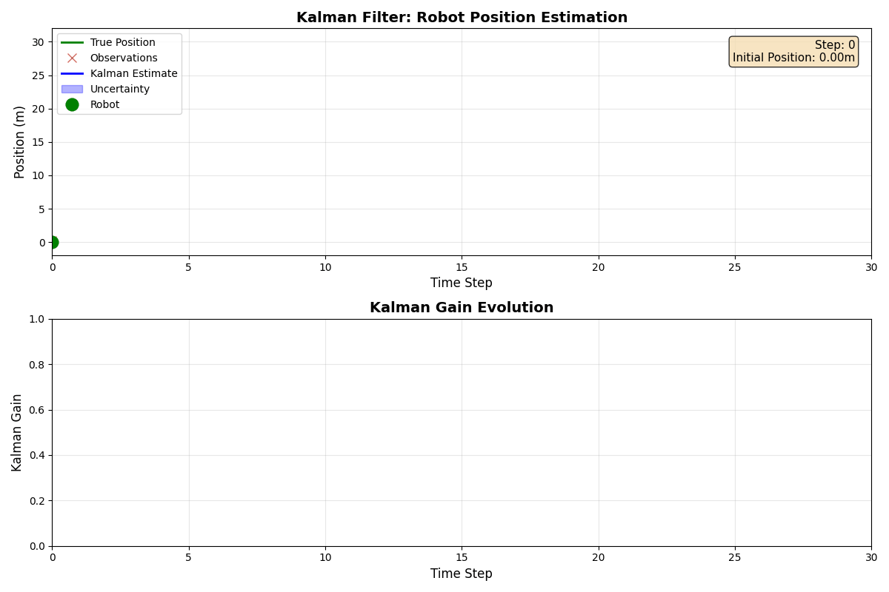

# Kalman Filter Robot Simulation

ノイズのある観測値からロボットの位置を推定するカルマンフィルタのシミュレーション

## 線形カルマンフィルタ (1D Robot)

1次元ロボットの位置推定



## 拡張カルマンフィルタ (2D Robot)

2次元ロボットの位置・姿勢推定


## 動作確認済み環境

- Ubuntu 22.04, 24.04
- Python 3.9, 3.10, 3.11, 3.12, 3.13

## 環境構築

```bash
# conda環境の作成
conda create -n kalman python=3.11

# 環境の有効化
conda activate kalman

# パッケージのインストール
pip install -r requirements.txt
```

## 実行方法

```bash
# 線形カルマンフィルタ
python examples/01_linear_example.py
python examples/02_animation_example.py

# 拡張カルマンフィルタ
python examples_2d/01_nonlinear_example.py
python examples_2d/02_animation_example.py
```

## 参考文献

- [上田先生が開講された確率ロボティクスの授業](https://github.com/ryuichiueda/slides_marp/tree/master/prob_robotics_2025)
